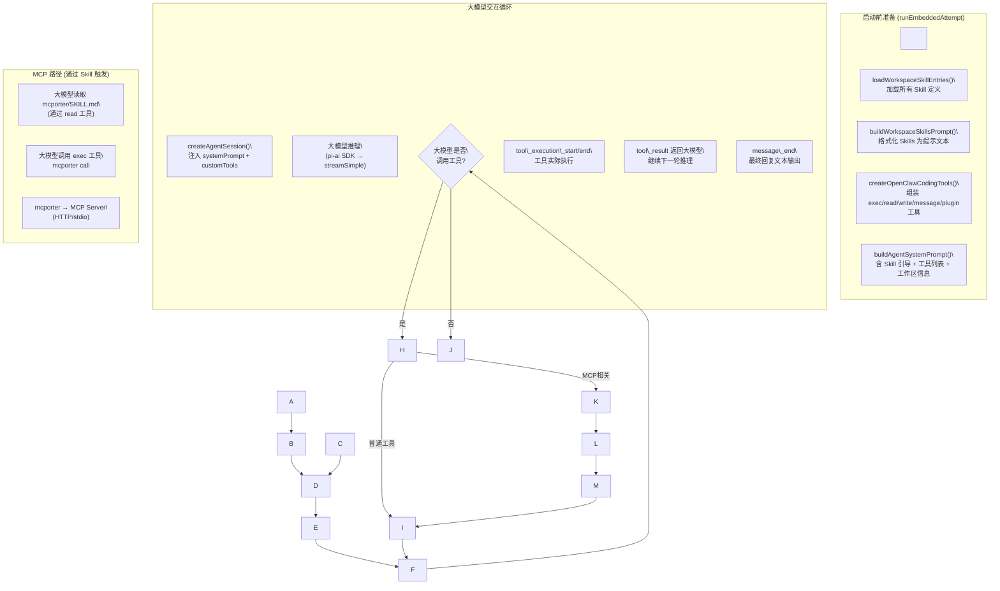

\# 应用编排层：Skill、MCP 与 AgentLoop 的组合与交互


\## 总体架构概览


三者的关系是：\*\*Skill 作为系统提示注入\*\*、\*\*MCP 通过 mcporter Skill 桥接\*\*、\*\*AgentLoop（`runEmbeddedAttempt`）将两者与大模型/工具串联起来\*\*，形成一个完整的请求→推理→工具调用→回复的循环。


```mermaid

sequenceDiagram

&nbsp;   participant U as "用户 (Channel)"

&nbsp;   participant GW as "Gateway"

&nbsp;   participant AL as "AgentLoop (runEmbeddedAttempt)"

&nbsp;   participant SP as "System Prompt (Skills注入)"

&nbsp;   participant LLM as "大模型 API"

&nbsp;   participant T as "工具集 (exec/read/write/...)"

&nbsp;   participant MCP as "mcporter CLI (MCP Bridge)"


&nbsp;   U->>GW: 发送消息

&nbsp;   GW->>AL: runEmbeddedPiAgent()

&nbsp;   AL->>SP: buildWorkspaceSkillSnapshot() → skillsPrompt

&nbsp;   AL->>SP: createOpenClawCodingTools() → 工具集

&nbsp;   AL->>LLM: 附带 systemPrompt + tools 发起第一次请求

&nbsp;   LLM-->>AL: 返回 tool\_call (e.g. exec: mcporter call xxx.tool)

&nbsp;   AL->>T: 执行 exec 工具

&nbsp;   T->>MCP: 调用 mcporter CLI

&nbsp;   MCP-->>T: 返回 MCP Server 结果

&nbsp;   T-->>AL: tool\_result

&nbsp;   AL->>LLM: 附带 tool\_result 继续对话

&nbsp;   LLM-->>AL: 最终回复文本

&nbsp;   AL->>U: subscribeEmbeddedPiSession() 流式输出

```


---


\## 一、Skill 层：知识注入进 System Prompt


\### Skill 是什么


Skill 是放在 `skills/<name>/SKILL.md` 目录下的 Markdown 文件（带 YAML frontmatter），每个 Skill 描述一种外部能力（如 GitHub、Notion、mcporter 等）以及使用方法。Skill 本身\*\*不是工具\*\*，而是\*\*大模型的行为指南\*\*。 \[1](#0-0) 


\### Skill 如何加载


`loadSkillEntries()` 从多个目录（bundled、managed、workspace、plugin 提供的等）扫描并合并 Skill，优先级从低到高依次为：extra < bundled < managed < agents-skills-personal < agents-skills-project < workspace。 \[2](#0-1) 


\### Skill 如何注入 System Prompt


`buildWorkspaceSkillsPrompt()` / `buildWorkspaceSkillSnapshot()` 将所有符合条件的 Skill 格式化为文本块，最终作为 `skillsPrompt` 参数注入到 System Prompt 的 `## Skills (mandatory)` 段落中： \[3](#0-2) 


System Prompt 会指导大模型：如果某个 Skill 明显匹配当前任务，先用 `read` 工具读取对应 `SKILL.md` 文件，然后按其指示行动。


\### Skill 在 AgentLoop 中被触发的时机


在 `runEmbeddedAttempt` 中，每次运行前都会调用 `resolveSkillsPromptForRun()` 准备好 Skill 提示，并通过 `applySkillEnvOverrides` 注入 Skill 可能需要的环境变量： \[4](#0-3) 


---


\## 二、MCP 层：通过 mcporter Skill 桥接


\### 设计哲学：桥接而非内置


项目明确选择\*\*不在核心运行时内置 MCP 协议客户端\*\*，而是通过外部 `mcporter` CLI 工具桥接： \[5](#0-4) 


\### mcporter 作为 Skill 存在


MCP 的集成入口是 `skills/mcporter/SKILL.md`，它是一个普通 Skill，描述了如何用 `mcporter` CLI 来列举、调用、认证 MCP Server： \[6](#0-5) 


\### MCP 工具调用流程


当大模型根据 System Prompt 里的 mcporter Skill 描述决定调用某个 MCP 工具时：


1\. 大模型生成 `exec` 工具调用，命令为 `mcporter call <server.tool> key=value`

2\. AgentLoop 通过 `createExecTool` 执行该 shell 命令

3\. `mcporter` 与实际 MCP Server（HTTP 或 stdio）通信

4\. 结果作为 `tool\_result` 返回给大模型继续推理 \[7](#0-6) 


---


\## 三、AgentLoop：编排核心


AgentLoop 的核心实现分两层：\*\*`runEmbeddedPiAgent`（外层，负责鉴权/重试/compaction）\*\* 和 \*\*`runEmbeddedAttempt`（内层，负责单次实际执行）\*\*。


\### 外层：runEmbeddedPiAgent


负责模型解析、Auth Profile 轮换、Context Overflow 时的 compaction 重试等： \[8](#0-7) 


\### 内层：runEmbeddedAttempt 的执行阶段


\#### 阶段 1：沙盒 \& Skill 环境准备 \[9](#0-8) 


\#### 阶段 2：构建工具集（含 Plugin 工具）


`createOpenClawCodingTools()` 组装所有工具：文件读写工具、exec/process 工具、OpenClaw 平台工具（message/cron/sessions 等），以及来自插件的工具。Plugin 工具通过 `resolvePluginTools()` 动态加载： \[10](#0-9) \[11](#0-10) 


\#### 阶段 3：构建 System Prompt（含 Skills） \[12](#0-11) \[13](#0-12) 


\#### 阶段 4：工具分发 \& Session 创建


工具通过 `splitSdkTools()` 全部作为 `customTools` 传给底层 `createAgentSession()`，不使用任何 SDK 内置工具： \[14](#0-13) \[15](#0-14) 


\#### 阶段 5：工具策略管道（Deny-Wins 过滤链）


所有工具在注册前经过多层策略过滤：global → provider → agent → group → sandbox → subagent，每层只能限制，不能扩展工具集： \[16](#0-15) 


\#### 阶段 6：订阅大模型流式输出（subscribeEmbeddedPiSession）


`subscribeEmbeddedPiSession` 订阅 agent session 的所有事件，处理消息流、工具执行事件、compaction 事件等，并通过回调将内容分块推送给用户： \[17](#0-16) 


事件处理器统一分发到 lifecycle、message、tools 三类处理器： \[18](#0-17) 


---


\## 四、完整交互流程总结





\### 关键要点


| 组件 | 在架构中的角色 | 参与方式 |

|------|--------------|---------|

| \*\*Skill\*\* | 大模型行为指南 | 以文本形式注入 System Prompt 的 `## Skills` 段，告知模型可用的外部能力和调用方式 |

| \*\*MCP (mcporter)\*\* | 外部 MCP Server 桥接 | 作为一个特殊 Skill（`skills/mcporter/SKILL.md`），大模型通过 `exec` 工具调用 `mcporter` CLI 来与 MCP Server 交互 |

| \*\*AgentLoop\*\* | 编排核心 | `runEmbeddedPiAgent` → `runEmbeddedAttempt` 串联 Skill 注入、工具构建、模型调用、流式输出，形成完整的推理-工具-回复循环 | \[19](#0-18) 


---


\## Notes


1\. \*\*MCP 不是内置 Runtime\*\*：项目明确声明不将 MCP 内置到核心（`VISION.md`），所有 MCP 操作都通过 `mcporter` CLI 桥接，走 `exec` 工具路径，因此 MCP 工具在大模型眼中就是一个 shell 命令。


2\. \*\*Skills 不是运行时工具\*\*：Skill 只是 Markdown 文档，它们通过 System Prompt 告诉大模型"有什么能力可用"，大模型自行决定是否读取 SKILL.md 并遵照执行。真正的执行能力来自 `exec`/`read` 等运行时工具。


3\. \*\*Plugin 工具 vs Skill\*\*：Plugin 系统（`src/plugins/tools.ts`）可以注册真正的原生工具（带有 `execute` 函数），会出现在工具列表中供大模型直接调用；Skill 则仅影响 System Prompt，不注册工具。


4\. \*\*工具策略是 Deny-Wins 多层过滤\*\*：所有工具（包括通过插件注册的）都经过 global → provider → agent → group → sandbox 的策略管道，任意一层 deny 即生效，无法被后续层解除。


\### Citations


\*\*File:\*\* src/agents/skills/types.ts (L66-88)

```typescript

export type SkillEntry = {

&nbsp; skill: Skill;

&nbsp; frontmatter: ParsedSkillFrontmatter;

&nbsp; metadata?: OpenClawSkillMetadata;

&nbsp; invocation?: SkillInvocationPolicy;

};


export type SkillEligibilityContext = {

&nbsp; remote?: {

&nbsp;   platforms: string\[];

&nbsp;   hasBin: (bin: string) => boolean;

&nbsp;   hasAnyBin: (bins: string\[]) => boolean;

&nbsp;   note?: string;

&nbsp; };

};


export type SkillSnapshot = {

&nbsp; prompt: string;

&nbsp; skills: Array<{ name: string; primaryEnv?: string; requiredEnv?: string\[] }>;

&nbsp; /\*\* Normalized agent-level filter used to build this snapshot; undefined means unrestricted. \*/

&nbsp; skillFilter?: string\[];

&nbsp; resolvedSkills?: Skill\[];

&nbsp; version?: number;

```


\*\*File:\*\* src/agents/skills/workspace.ts (L369-405)

```typescript

&nbsp; const merged = new Map<string, Skill>();

&nbsp; // Precedence: extra < bundled < managed < agents-skills-personal < agents-skills-project < workspace

&nbsp; for (const skill of extraSkills) {

&nbsp;   merged.set(skill.name, skill);

&nbsp; }

&nbsp; for (const skill of bundledSkills) {

&nbsp;   merged.set(skill.name, skill);

&nbsp; }

&nbsp; for (const skill of managedSkills) {

&nbsp;   merged.set(skill.name, skill);

&nbsp; }

&nbsp; for (const skill of personalAgentsSkills) {

&nbsp;   merged.set(skill.name, skill);

&nbsp; }

&nbsp; for (const skill of projectAgentsSkills) {

&nbsp;   merged.set(skill.name, skill);

&nbsp; }

&nbsp; for (const skill of workspaceSkills) {

&nbsp;   merged.set(skill.name, skill);

&nbsp; }


&nbsp; const skillEntries: SkillEntry\[] = Array.from(merged.values()).map((skill) => {

&nbsp;   let frontmatter: ParsedSkillFrontmatter = {};

&nbsp;   try {

&nbsp;     const raw = fs.readFileSync(skill.filePath, "utf-8");

&nbsp;     frontmatter = parseFrontmatter(raw);

&nbsp;   } catch {

&nbsp;     // ignore malformed skills

&nbsp;   }

&nbsp;   return {

&nbsp;     skill,

&nbsp;     frontmatter,

&nbsp;     metadata: resolveOpenClawMetadata(frontmatter),

&nbsp;     invocation: resolveSkillInvocationPolicy(frontmatter),

&nbsp;   };

&nbsp; });

&nbsp; return skillEntries;

```


\*\*File:\*\* src/agents/system-prompt.ts (L19-41)

```typescript

function buildSkillsSection(params: {

&nbsp; skillsPrompt?: string;

&nbsp; isMinimal: boolean;

&nbsp; readToolName: string;

}) {

&nbsp; if (params.isMinimal) {

&nbsp;   return \[];

&nbsp; }

&nbsp; const trimmed = params.skillsPrompt?.trim();

&nbsp; if (!trimmed) {

&nbsp;   return \[];

&nbsp; }

&nbsp; return \[

&nbsp;   "## Skills (mandatory)",

&nbsp;   "Before replying: scan <available\_skills> <description> entries.",

&nbsp;   `- If exactly one skill clearly applies: read its SKILL.md at <location> with \\`${params.readToolName}\\`, then follow it.`,

&nbsp;   "- If multiple could apply: choose the most specific one, then read/follow it.",

&nbsp;   "- If none clearly apply: do not read any SKILL.md.",

&nbsp;   "Constraints: never read more than one skill up front; only read after selecting.",

&nbsp;   trimmed,

&nbsp;   "",

&nbsp; ];

}

```


\*\*File:\*\* src/agents/pi-embedded-runner/run/attempt.ts (L239-273)

```typescript

&nbsp; const sandbox = await resolveSandboxContext({

&nbsp;   config: params.config,

&nbsp;   sessionKey: sandboxSessionKey,

&nbsp;   workspaceDir: resolvedWorkspace,

&nbsp; });

&nbsp; const effectiveWorkspace = sandbox?.enabled

&nbsp;   ? sandbox.workspaceAccess === "rw"

&nbsp;     ? resolvedWorkspace

&nbsp;     : sandbox.workspaceDir

&nbsp;   : resolvedWorkspace;

&nbsp; await fs.mkdir(effectiveWorkspace, { recursive: true });


&nbsp; let restoreSkillEnv: (() => void) | undefined;

&nbsp; process.chdir(effectiveWorkspace);

&nbsp; try {

&nbsp;   const shouldLoadSkillEntries = !params.skillsSnapshot || !params.skillsSnapshot.resolvedSkills;

&nbsp;   const skillEntries = shouldLoadSkillEntries

&nbsp;     ? loadWorkspaceSkillEntries(effectiveWorkspace)

&nbsp;     : \[];

&nbsp;   restoreSkillEnv = params.skillsSnapshot

&nbsp;     ? applySkillEnvOverridesFromSnapshot({

&nbsp;         snapshot: params.skillsSnapshot,

&nbsp;         config: params.config,

&nbsp;       })

&nbsp;     : applySkillEnvOverrides({

&nbsp;         skills: skillEntries ?? \[],

&nbsp;         config: params.config,

&nbsp;       });


&nbsp;   const skillsPrompt = resolveSkillsPromptForRun({

&nbsp;     skillsSnapshot: params.skillsSnapshot,

&nbsp;     entries: shouldLoadSkillEntries ? skillEntries : undefined,

&nbsp;     config: params.config,

&nbsp;     workspaceDir: effectiveWorkspace,

&nbsp;   });

```


\*\*File:\*\* src/agents/pi-embedded-runner/run/attempt.ts (L440-471)

```typescript

&nbsp;   const appendPrompt = buildEmbeddedSystemPrompt({

&nbsp;     workspaceDir: effectiveWorkspace,

&nbsp;     defaultThinkLevel: params.thinkLevel,

&nbsp;     reasoningLevel: params.reasoningLevel ?? "off",

&nbsp;     extraSystemPrompt: params.extraSystemPrompt,

&nbsp;     ownerNumbers: params.ownerNumbers,

&nbsp;     ownerDisplay: params.config?.commands?.ownerDisplay,

&nbsp;     ownerDisplaySecret:

&nbsp;       params.config?.commands?.ownerDisplaySecret ??

&nbsp;       params.config?.gateway?.auth?.token ??

&nbsp;       params.config?.gateway?.remote?.token,

&nbsp;     reasoningTagHint,

&nbsp;     heartbeatPrompt: isDefaultAgent

&nbsp;       ? resolveHeartbeatPrompt(params.config?.agents?.defaults?.heartbeat?.prompt)

&nbsp;       : undefined,

&nbsp;     skillsPrompt,

&nbsp;     docsPath: docsPath ?? undefined,

&nbsp;     ttsHint,

&nbsp;     workspaceNotes,

&nbsp;     reactionGuidance,

&nbsp;     promptMode,

&nbsp;     runtimeInfo,

&nbsp;     messageToolHints,

&nbsp;     sandboxInfo,

&nbsp;     tools,

&nbsp;     modelAliasLines: buildModelAliasLines(params.config),

&nbsp;     userTimezone,

&nbsp;     userTime,

&nbsp;     userTimeFormat,

&nbsp;     contextFiles,

&nbsp;     memoryCitationsMode: params.config?.memory?.citations,

&nbsp;   });

```


\*\*File:\*\* src/agents/pi-embedded-runner/run/attempt.ts (L572-611)

```typescript

&nbsp;     const { builtInTools, customTools } = splitSdkTools({

&nbsp;       tools,

&nbsp;       sandboxEnabled: !!sandbox?.enabled,

&nbsp;     });


&nbsp;     // Add client tools (OpenResponses hosted tools) to customTools

&nbsp;     let clientToolCallDetected: { name: string; params: Record<string, unknown> } | null = null;

&nbsp;     const clientToolLoopDetection = resolveToolLoopDetectionConfig({

&nbsp;       cfg: params.config,

&nbsp;       agentId: sessionAgentId,

&nbsp;     });

&nbsp;     const clientToolDefs = params.clientTools

&nbsp;       ? toClientToolDefinitions(

&nbsp;           params.clientTools,

&nbsp;           (toolName, toolParams) => {

&nbsp;             clientToolCallDetected = { name: toolName, params: toolParams };

&nbsp;           },

&nbsp;           {

&nbsp;             agentId: sessionAgentId,

&nbsp;             sessionKey: params.sessionKey,

&nbsp;             loopDetection: clientToolLoopDetection,

&nbsp;           },

&nbsp;         )

&nbsp;       : \[];


&nbsp;     const allCustomTools = \[...customTools, ...clientToolDefs];


&nbsp;     ({ session } = await createAgentSession({

&nbsp;       cwd: resolvedWorkspace,

&nbsp;       agentDir,

&nbsp;       authStorage: params.authStorage,

&nbsp;       modelRegistry: params.modelRegistry,

&nbsp;       model: params.model,

&nbsp;       thinkingLevel: mapThinkingLevel(params.thinkLevel),

&nbsp;       tools: builtInTools,

&nbsp;       customTools: allCustomTools,

&nbsp;       sessionManager,

&nbsp;       settingsManager,

&nbsp;       resourceLoader,

&nbsp;     }));

```


\*\*File:\*\* src/agents/pi-embedded-runner/run/attempt.ts (L803-840)

```typescript

&nbsp;     const subscription = subscribeEmbeddedPiSession({

&nbsp;       session: activeSession,

&nbsp;       runId: params.runId,

&nbsp;       hookRunner: getGlobalHookRunner() ?? undefined,

&nbsp;       verboseLevel: params.verboseLevel,

&nbsp;       reasoningMode: params.reasoningLevel ?? "off",

&nbsp;       toolResultFormat: params.toolResultFormat,

&nbsp;       shouldEmitToolResult: params.shouldEmitToolResult,

&nbsp;       shouldEmitToolOutput: params.shouldEmitToolOutput,

&nbsp;       onToolResult: params.onToolResult,

&nbsp;       onReasoningStream: params.onReasoningStream,

&nbsp;       onReasoningEnd: params.onReasoningEnd,

&nbsp;       onBlockReply: params.onBlockReply,

&nbsp;       onBlockReplyFlush: params.onBlockReplyFlush,

&nbsp;       blockReplyBreak: params.blockReplyBreak,

&nbsp;       blockReplyChunking: params.blockReplyChunking,

&nbsp;       onPartialReply: params.onPartialReply,

&nbsp;       onAssistantMessageStart: params.onAssistantMessageStart,

&nbsp;       onAgentEvent: params.onAgentEvent,

&nbsp;       enforceFinalTag: params.enforceFinalTag,

&nbsp;       config: params.config,

&nbsp;       sessionKey: params.sessionKey ?? params.sessionId,

&nbsp;     });


&nbsp;     const {

&nbsp;       assistantTexts,

&nbsp;       toolMetas,

&nbsp;       unsubscribe,

&nbsp;       waitForCompactionRetry,

&nbsp;       getMessagingToolSentTexts,

&nbsp;       getMessagingToolSentMediaUrls,

&nbsp;       getMessagingToolSentTargets,

&nbsp;       getSuccessfulCronAdds,

&nbsp;       didSendViaMessagingTool,

&nbsp;       getLastToolError,

&nbsp;       getUsageTotals,

&nbsp;       getCompactionCount,

&nbsp;     } = subscription;

```


\*\*File:\*\* VISION.md (L73-106)

```markdown


OpenClaw supports MCP through `mcporter`: https://github.com/steipete/mcporter


This keeps MCP integration flexible and decoupled from core runtime:


\- add or change MCP servers without restarting the gateway

\- keep core tool/context surface lean

\- reduce MCP churn impact on core stability and security


For now, we prefer this bridge model over building first-class MCP runtime into core.

If there is an MCP server or feature `mcporter` does not support yet, please open an issue there.


\### Setup


OpenClaw is currently terminal-first by design.

This keeps setup explicit: users see docs, auth, permissions, and security posture up front.


Long term, we want easier onboarding flows as hardening matures.

We do not want convenience wrappers that hide critical security decisions from users.


\### Why TypeScript?


OpenClaw is primarily an orchestration system: prompts, tools, protocols, and integrations.

TypeScript was chosen to keep OpenClaw hackable by default.

It is widely known, fast to iterate in, and easy to read, modify, and extend.


\## What We Will Not Merge (For Now)


\- New core skills when they can live on ClawHub

\- Full-doc translation sets for all docs (deferred; we plan AI-generated translations later)

\- Commercial service integrations that do not clearly fit the model-provider category

\- Wrapper channels around already supported channels without a clear capability or security gap

\- First-class MCP runtime in core when `mcporter` already provides the integration path

\- Agent-hierarchy frameworks (manager-of-managers / nested planner trees) as a default architecture

```


\*\*File:\*\* skills/mcporter/SKILL.md (L1-58)

```markdown

---

name: mcporter

description: Use the mcporter CLI to list, configure, auth, and call MCP servers/tools directly (HTTP or stdio), including ad-hoc servers, config edits, and CLI/type generation.

homepage: http://mcporter.dev

metadata:

&nbsp; {

&nbsp;   "openclaw":

&nbsp;     {

&nbsp;       "emoji": "📦",

&nbsp;       "requires": { "bins": \["mcporter"] },

&nbsp;       "install":

&nbsp;         \[

&nbsp;           {

&nbsp;             "id": "node",

&nbsp;             "kind": "node",

&nbsp;             "package": "mcporter",

&nbsp;             "bins": \["mcporter"],

&nbsp;             "label": "Install mcporter (node)",

&nbsp;           },

&nbsp;         ],

&nbsp;     },

&nbsp; }

---


\# mcporter


Use `mcporter` to work with MCP servers directly.


Quick start


\- `mcporter list`

\- `mcporter list <server> --schema`

\- `mcporter call <server.tool> key=value`


Call tools


\- Selector: `mcporter call linear.list\_issues team=ENG limit:5`

\- Function syntax: `mcporter call "linear.create\_issue(title: \\"Bug\\")"`

\- Full URL: `mcporter call https://api.example.com/mcp.fetch url:https://example.com`

\- Stdio: `mcporter call --stdio "bun run ./server.ts" scrape url=https://example.com`

\- JSON payload: `mcporter call <server.tool> --args '{"limit":5}'`


Auth + config


\- OAuth: `mcporter auth <server | url> \[--reset]`

\- Config: `mcporter config list|get|add|remove|import|login|logout`


Daemon


\- `mcporter daemon start|status|stop|restart`


Codegen


\- CLI: `mcporter generate-cli --server <name>` or `--command <url>`

\- Inspect: `mcporter inspect-cli <path> \[--json]`

\- TS: `mcporter emit-ts <server> --mode client|types`


Notes

```


\*\*File:\*\* src/agents/pi-tools.ts (L294-461)

```typescript

&nbsp;   isOpenAIProvider(options?.modelProvider) \&\&

&nbsp;   isApplyPatchAllowedForModel({

&nbsp;     modelProvider: options?.modelProvider,

&nbsp;     modelId: options?.modelId,

&nbsp;     allowModels: applyPatchConfig?.allowModels,

&nbsp;   });


&nbsp; if (sandboxRoot \&\& !sandboxFsBridge) {

&nbsp;   throw new Error("Sandbox filesystem bridge is unavailable.");

&nbsp; }

&nbsp; const imageSanitization = resolveImageSanitizationLimits(options?.config);


&nbsp; const base = (codingTools as unknown as AnyAgentTool\[]).flatMap((tool) => {

&nbsp;   if (tool.name === readTool.name) {

&nbsp;     if (sandboxRoot) {

&nbsp;       const sandboxed = createSandboxedReadTool({

&nbsp;         root: sandboxRoot,

&nbsp;         bridge: sandboxFsBridge!,

&nbsp;         modelContextWindowTokens: options?.modelContextWindowTokens,

&nbsp;         imageSanitization,

&nbsp;       });

&nbsp;       return \[workspaceOnly ? wrapToolWorkspaceRootGuard(sandboxed, sandboxRoot) : sandboxed];

&nbsp;     }

&nbsp;     const freshReadTool = createReadTool(workspaceRoot);

&nbsp;     const wrapped = createOpenClawReadTool(freshReadTool, {

&nbsp;       modelContextWindowTokens: options?.modelContextWindowTokens,

&nbsp;       imageSanitization,

&nbsp;     });

&nbsp;     return \[workspaceOnly ? wrapToolWorkspaceRootGuard(wrapped, workspaceRoot) : wrapped];

&nbsp;   }

&nbsp;   if (tool.name === "bash" || tool.name === execToolName) {

&nbsp;     return \[];

&nbsp;   }

&nbsp;   if (tool.name === "write") {

&nbsp;     if (sandboxRoot) {

&nbsp;       return \[];

&nbsp;     }

&nbsp;     // Wrap with param normalization for Claude Code compatibility

&nbsp;     const wrapped = wrapToolParamNormalization(

&nbsp;       createWriteTool(workspaceRoot),

&nbsp;       CLAUDE\_PARAM\_GROUPS.write,

&nbsp;     );

&nbsp;     return \[workspaceOnly ? wrapToolWorkspaceRootGuard(wrapped, workspaceRoot) : wrapped];

&nbsp;   }

&nbsp;   if (tool.name === "edit") {

&nbsp;     if (sandboxRoot) {

&nbsp;       return \[];

&nbsp;     }

&nbsp;     // Wrap with param normalization for Claude Code compatibility

&nbsp;     const wrapped = wrapToolParamNormalization(

&nbsp;       createEditTool(workspaceRoot),

&nbsp;       CLAUDE\_PARAM\_GROUPS.edit,

&nbsp;     );

&nbsp;     return \[workspaceOnly ? wrapToolWorkspaceRootGuard(wrapped, workspaceRoot) : wrapped];

&nbsp;   }

&nbsp;   return \[tool];

&nbsp; });

&nbsp; const { cleanupMs: cleanupMsOverride, ...execDefaults } = options?.exec ?? {};

&nbsp; const execTool = createExecTool({

&nbsp;   ...execDefaults,

&nbsp;   host: options?.exec?.host ?? execConfig.host,

&nbsp;   security: options?.exec?.security ?? execConfig.security,

&nbsp;   ask: options?.exec?.ask ?? execConfig.ask,

&nbsp;   node: options?.exec?.node ?? execConfig.node,

&nbsp;   pathPrepend: options?.exec?.pathPrepend ?? execConfig.pathPrepend,

&nbsp;   safeBins: options?.exec?.safeBins ?? execConfig.safeBins,

&nbsp;   agentId,

&nbsp;   cwd: workspaceRoot,

&nbsp;   allowBackground,

&nbsp;   scopeKey,

&nbsp;   sessionKey: options?.sessionKey,

&nbsp;   messageProvider: options?.messageProvider,

&nbsp;   backgroundMs: options?.exec?.backgroundMs ?? execConfig.backgroundMs,

&nbsp;   timeoutSec: options?.exec?.timeoutSec ?? execConfig.timeoutSec,

&nbsp;   approvalRunningNoticeMs:

&nbsp;     options?.exec?.approvalRunningNoticeMs ?? execConfig.approvalRunningNoticeMs,

&nbsp;   notifyOnExit: options?.exec?.notifyOnExit ?? execConfig.notifyOnExit,

&nbsp;   notifyOnExitEmptySuccess:

&nbsp;     options?.exec?.notifyOnExitEmptySuccess ?? execConfig.notifyOnExitEmptySuccess,

&nbsp;   sandbox: sandbox

&nbsp;     ? {

&nbsp;         containerName: sandbox.containerName,

&nbsp;         workspaceDir: sandbox.workspaceDir,

&nbsp;         containerWorkdir: sandbox.containerWorkdir,

&nbsp;         env: sandbox.docker.env,

&nbsp;       }

&nbsp;     : undefined,

&nbsp; });

&nbsp; const processTool = createProcessTool({

&nbsp;   cleanupMs: cleanupMsOverride ?? execConfig.cleanupMs,

&nbsp;   scopeKey,

&nbsp; });

&nbsp; const applyPatchTool =

&nbsp;   !applyPatchEnabled || (sandboxRoot \&\& !allowWorkspaceWrites)

&nbsp;     ? null

&nbsp;     : createApplyPatchTool({

&nbsp;         cwd: sandboxRoot ?? workspaceRoot,

&nbsp;         sandbox:

&nbsp;           sandboxRoot \&\& allowWorkspaceWrites

&nbsp;             ? { root: sandboxRoot, bridge: sandboxFsBridge! }

&nbsp;             : undefined,

&nbsp;         workspaceOnly: applyPatchWorkspaceOnly,

&nbsp;       });

&nbsp; const tools: AnyAgentTool\[] = \[

&nbsp;   ...base,

&nbsp;   ...(sandboxRoot

&nbsp;     ? allowWorkspaceWrites

&nbsp;       ? \[

&nbsp;           workspaceOnly

&nbsp;             ? wrapToolWorkspaceRootGuard(

&nbsp;                 createSandboxedEditTool({ root: sandboxRoot, bridge: sandboxFsBridge! }),

&nbsp;                 sandboxRoot,

&nbsp;               )

&nbsp;             : createSandboxedEditTool({ root: sandboxRoot, bridge: sandboxFsBridge! }),

&nbsp;           workspaceOnly

&nbsp;             ? wrapToolWorkspaceRootGuard(

&nbsp;                 createSandboxedWriteTool({ root: sandboxRoot, bridge: sandboxFsBridge! }),

&nbsp;                 sandboxRoot,

&nbsp;               )

&nbsp;             : createSandboxedWriteTool({ root: sandboxRoot, bridge: sandboxFsBridge! }),

&nbsp;         ]

&nbsp;       : \[]

&nbsp;     : \[]),

&nbsp;   ...(applyPatchTool ? \[applyPatchTool as unknown as AnyAgentTool] : \[]),

&nbsp;   execTool as unknown as AnyAgentTool,

&nbsp;   processTool as unknown as AnyAgentTool,

&nbsp;   // Channel docking: include channel-defined agent tools (login, etc.).

&nbsp;   ...listChannelAgentTools({ cfg: options?.config }),

&nbsp;   ...createOpenClawTools({

&nbsp;     sandboxBrowserBridgeUrl: sandbox?.browser?.bridgeUrl,

&nbsp;     allowHostBrowserControl: sandbox ? sandbox.browserAllowHostControl : true,

&nbsp;     agentSessionKey: options?.sessionKey,

&nbsp;     agentChannel: resolveGatewayMessageChannel(options?.messageProvider),

&nbsp;     agentAccountId: options?.agentAccountId,

&nbsp;     agentTo: options?.messageTo,

&nbsp;     agentThreadId: options?.messageThreadId,

&nbsp;     agentGroupId: options?.groupId ?? null,

&nbsp;     agentGroupChannel: options?.groupChannel ?? null,

&nbsp;     agentGroupSpace: options?.groupSpace ?? null,

&nbsp;     agentDir: options?.agentDir,

&nbsp;     sandboxRoot,

&nbsp;     sandboxFsBridge,

&nbsp;     workspaceDir: workspaceRoot,

&nbsp;     sandboxed: !!sandbox,

&nbsp;     config: options?.config,

&nbsp;     pluginToolAllowlist: collectExplicitAllowlist(\[

&nbsp;       profilePolicy,

&nbsp;       providerProfilePolicy,

&nbsp;       globalPolicy,

&nbsp;       globalProviderPolicy,

&nbsp;       agentPolicy,

&nbsp;       agentProviderPolicy,

&nbsp;       groupPolicy,

&nbsp;       sandbox?.tools,

&nbsp;       subagentPolicy,

&nbsp;     ]),

&nbsp;     currentChannelId: options?.currentChannelId,

&nbsp;     currentThreadTs: options?.currentThreadTs,

&nbsp;     replyToMode: options?.replyToMode,

&nbsp;     hasRepliedRef: options?.hasRepliedRef,

&nbsp;     modelHasVision: options?.modelHasVision,

&nbsp;     requireExplicitMessageTarget: options?.requireExplicitMessageTarget,

&nbsp;     disableMessageTool: options?.disableMessageTool,

&nbsp;     requesterAgentIdOverride: agentId,

&nbsp;     requesterSenderId: options?.senderId,

&nbsp;     senderIsOwner: options?.senderIsOwner,

&nbsp;   }),

&nbsp; ];

```


\*\*File:\*\* src/agents/pi-tools.ts (L464-501)

```typescript

&nbsp; const toolsByAuthorization = applyOwnerOnlyToolPolicy(tools, senderIsOwner);

&nbsp; const subagentFiltered = applyToolPolicyPipeline({

&nbsp;   tools: toolsByAuthorization,

&nbsp;   toolMeta: (tool) => getPluginToolMeta(tool),

&nbsp;   warn: logWarn,

&nbsp;   steps: \[

&nbsp;     ...buildDefaultToolPolicyPipelineSteps({

&nbsp;       profilePolicy: profilePolicyWithAlsoAllow,

&nbsp;       profile,

&nbsp;       providerProfilePolicy: providerProfilePolicyWithAlsoAllow,

&nbsp;       providerProfile,

&nbsp;       globalPolicy,

&nbsp;       globalProviderPolicy,

&nbsp;       agentPolicy,

&nbsp;       agentProviderPolicy,

&nbsp;       groupPolicy,

&nbsp;       agentId,

&nbsp;     }),

&nbsp;     { policy: sandbox?.tools, label: "sandbox tools.allow" },

&nbsp;     { policy: subagentPolicy, label: "subagent tools.allow" },

&nbsp;   ],

&nbsp; });

&nbsp; // Always normalize tool JSON Schemas before handing them to pi-agent/pi-ai.

&nbsp; // Without this, some providers (notably OpenAI) will reject root-level union schemas.

&nbsp; // Provider-specific cleaning: Gemini needs constraint keywords stripped, but Anthropic expects them.

&nbsp; const normalized = subagentFiltered.map((tool) =>

&nbsp;   normalizeToolParameters(tool, { modelProvider: options?.modelProvider }),

&nbsp; );

&nbsp; const withHooks = normalized.map((tool) =>

&nbsp;   wrapToolWithBeforeToolCallHook(tool, {

&nbsp;     agentId,

&nbsp;     sessionKey: options?.sessionKey,

&nbsp;     loopDetection: resolveToolLoopDetectionConfig({ cfg: options?.config, agentId }),

&nbsp;   }),

&nbsp; );

&nbsp; const withAbort = options?.abortSignal

&nbsp;   ? withHooks.map((tool) => wrapToolWithAbortSignal(tool, options.abortSignal))

&nbsp;   : withHooks;

```


\*\*File:\*\* src/agents/pi-embedded-runner/run.ts (L174-200)

```typescript

export async function runEmbeddedPiAgent(

&nbsp; params: RunEmbeddedPiAgentParams,

): Promise<EmbeddedPiRunResult> {

&nbsp; const sessionLane = resolveSessionLane(params.sessionKey?.trim() || params.sessionId);

&nbsp; const globalLane = resolveGlobalLane(params.lane);

&nbsp; const enqueueGlobal =

&nbsp;   params.enqueue ?? ((task, opts) => enqueueCommandInLane(globalLane, task, opts));

&nbsp; const enqueueSession =

&nbsp;   params.enqueue ?? ((task, opts) => enqueueCommandInLane(sessionLane, task, opts));

&nbsp; const channelHint = params.messageChannel ?? params.messageProvider;

&nbsp; const resolvedToolResultFormat =

&nbsp;   params.toolResultFormat ??

&nbsp;   (channelHint

&nbsp;     ? isMarkdownCapableMessageChannel(channelHint)

&nbsp;       ? "markdown"

&nbsp;       : "plain"

&nbsp;     : "markdown");

&nbsp; const isProbeSession = params.sessionId?.startsWith("probe-") ?? false;


&nbsp; return enqueueSession(() =>

&nbsp;   enqueueGlobal(async () => {

&nbsp;     const started = Date.now();

&nbsp;     const workspaceResolution = resolveRunWorkspaceDir({

&nbsp;       workspaceDir: params.workspaceDir,

&nbsp;       sessionKey: params.sessionKey,

&nbsp;       agentId: params.agentId,

&nbsp;       config: params.config,

```


\*\*File:\*\* src/agents/openclaw-tools.ts (L25-68)

```typescript

export function createOpenClawTools(options?: {

&nbsp; sandboxBrowserBridgeUrl?: string;

&nbsp; allowHostBrowserControl?: boolean;

&nbsp; agentSessionKey?: string;

&nbsp; agentChannel?: GatewayMessageChannel;

&nbsp; agentAccountId?: string;

&nbsp; /\*\* Delivery target (e.g. telegram:group:123:topic:456) for topic/thread routing. \*/

&nbsp; agentTo?: string;

&nbsp; /\*\* Thread/topic identifier for routing replies to the originating thread. \*/

&nbsp; agentThreadId?: string | number;

&nbsp; /\*\* Group id for channel-level tool policy inheritance. \*/

&nbsp; agentGroupId?: string | null;

&nbsp; /\*\* Group channel label for channel-level tool policy inheritance. \*/

&nbsp; agentGroupChannel?: string | null;

&nbsp; /\*\* Group space label for channel-level tool policy inheritance. \*/

&nbsp; agentGroupSpace?: string | null;

&nbsp; agentDir?: string;

&nbsp; sandboxRoot?: string;

&nbsp; sandboxFsBridge?: SandboxFsBridge;

&nbsp; workspaceDir?: string;

&nbsp; sandboxed?: boolean;

&nbsp; config?: OpenClawConfig;

&nbsp; pluginToolAllowlist?: string\[];

&nbsp; /\*\* Current channel ID for auto-threading (Slack). \*/

&nbsp; currentChannelId?: string;

&nbsp; /\*\* Current thread timestamp for auto-threading (Slack). \*/

&nbsp; currentThreadTs?: string;

&nbsp; /\*\* Reply-to mode for Slack auto-threading. \*/

&nbsp; replyToMode?: "off" | "first" | "all";

&nbsp; /\*\* Mutable ref to track if a reply was sent (for "first" mode). \*/

&nbsp; hasRepliedRef?: { value: boolean };

&nbsp; /\*\* If true, the model has native vision capability \*/

&nbsp; modelHasVision?: boolean;

&nbsp; /\*\* Explicit agent ID override for cron/hook sessions. \*/

&nbsp; requesterAgentIdOverride?: string;

&nbsp; /\*\* Require explicit message targets (no implicit last-route sends). \*/

&nbsp; requireExplicitMessageTarget?: boolean;

&nbsp; /\*\* If true, omit the message tool from the tool list. \*/

&nbsp; disableMessageTool?: boolean;

&nbsp; /\*\* Trusted sender id from inbound context (not tool args). \*/

&nbsp; requesterSenderId?: string | null;

&nbsp; /\*\* Whether the requesting sender is an owner. \*/

&nbsp; senderIsOwner?: boolean;

}): AnyAgentTool\[] {

```


\*\*File:\*\* src/agents/pi-embedded-runner/system-prompt.ts (L54-82)

```typescript

&nbsp; return buildAgentSystemPrompt({

&nbsp;   workspaceDir: params.workspaceDir,

&nbsp;   defaultThinkLevel: params.defaultThinkLevel,

&nbsp;   reasoningLevel: params.reasoningLevel,

&nbsp;   extraSystemPrompt: params.extraSystemPrompt,

&nbsp;   ownerNumbers: params.ownerNumbers,

&nbsp;   ownerDisplay: params.ownerDisplay,

&nbsp;   ownerDisplaySecret: params.ownerDisplaySecret,

&nbsp;   reasoningTagHint: params.reasoningTagHint,

&nbsp;   heartbeatPrompt: params.heartbeatPrompt,

&nbsp;   skillsPrompt: params.skillsPrompt,

&nbsp;   docsPath: params.docsPath,

&nbsp;   ttsHint: params.ttsHint,

&nbsp;   workspaceNotes: params.workspaceNotes,

&nbsp;   reactionGuidance: params.reactionGuidance,

&nbsp;   promptMode: params.promptMode,

&nbsp;   runtimeInfo: params.runtimeInfo,

&nbsp;   messageToolHints: params.messageToolHints,

&nbsp;   sandboxInfo: params.sandboxInfo,

&nbsp;   toolNames: params.tools.map((tool) => tool.name),

&nbsp;   toolSummaries: buildToolSummaryMap(params.tools),

&nbsp;   modelAliasLines: params.modelAliasLines,

&nbsp;   userTimezone: params.userTimezone,

&nbsp;   userTime: params.userTime,

&nbsp;   userTimeFormat: params.userTimeFormat,

&nbsp;   contextFiles: params.contextFiles,

&nbsp;   memoryCitationsMode: params.memoryCitationsMode,

&nbsp; });

}

```


\*\*File:\*\* src/agents/pi-embedded-runner/tool-split.ts (L1-17)

```typescript

import type { AgentTool } from "@mariozechner/pi-agent-core";

import { toToolDefinitions } from "../pi-tool-definition-adapter.js";


// We always pass tools via `customTools` so our policy filtering, sandbox integration,

// and extended toolset remain consistent across providers.

type AnyAgentTool = AgentTool;


export function splitSdkTools(options: { tools: AnyAgentTool\[]; sandboxEnabled: boolean }): {

&nbsp; builtInTools: AnyAgentTool\[];

&nbsp; customTools: ReturnType<typeof toToolDefinitions>;

} {

&nbsp; const { tools } = options;

&nbsp; return {

&nbsp;   builtInTools: \[],

&nbsp;   customTools: toToolDefinitions(tools),

&nbsp; };

}

```


\*\*File:\*\* src/agents/pi-embedded-subscribe.handlers.ts (L22-65)

```typescript

export function createEmbeddedPiSessionEventHandler(ctx: EmbeddedPiSubscribeContext) {

&nbsp; return (evt: EmbeddedPiSubscribeEvent) => {

&nbsp;   switch (evt.type) {

&nbsp;     case "message\_start":

&nbsp;       handleMessageStart(ctx, evt as never);

&nbsp;       return;

&nbsp;     case "message\_update":

&nbsp;       handleMessageUpdate(ctx, evt as never);

&nbsp;       return;

&nbsp;     case "message\_end":

&nbsp;       handleMessageEnd(ctx, evt as never);

&nbsp;       return;

&nbsp;     case "tool\_execution\_start":

&nbsp;       // Async handler - best-effort typing indicator, avoids blocking tool summaries.

&nbsp;       // Catch rejections to avoid unhandled promise rejection crashes.

&nbsp;       handleToolExecutionStart(ctx, evt as never).catch((err) => {

&nbsp;         ctx.log.debug(`tool\_execution\_start handler failed: ${String(err)}`);

&nbsp;       });

&nbsp;       return;

&nbsp;     case "tool\_execution\_update":

&nbsp;       handleToolExecutionUpdate(ctx, evt as never);

&nbsp;       return;

&nbsp;     case "tool\_execution\_end":

&nbsp;       // Async handler - best-effort, non-blocking

&nbsp;       handleToolExecutionEnd(ctx, evt as never).catch((err) => {

&nbsp;         ctx.log.debug(`tool\_execution\_end handler failed: ${String(err)}`);

&nbsp;       });

&nbsp;       return;

&nbsp;     case "agent\_start":

&nbsp;       handleAgentStart(ctx);

&nbsp;       return;

&nbsp;     case "auto\_compaction\_start":

&nbsp;       handleAutoCompactionStart(ctx);

&nbsp;       return;

&nbsp;     case "auto\_compaction\_end":

&nbsp;       handleAutoCompactionEnd(ctx, evt as never);

&nbsp;       return;

&nbsp;     case "agent\_end":

&nbsp;       handleAgentEnd(ctx);

&nbsp;       return;

&nbsp;     default:

&nbsp;       return;

&nbsp;   }

&nbsp; };

```


\*\*File:\*\* src/agents/pi-embedded-subscribe.ts (L34-80)

```typescript

export function subscribeEmbeddedPiSession(params: SubscribeEmbeddedPiSessionParams) {

&nbsp; const reasoningMode = params.reasoningMode ?? "off";

&nbsp; const toolResultFormat = params.toolResultFormat ?? "markdown";

&nbsp; const useMarkdown = toolResultFormat === "markdown";

&nbsp; const state: EmbeddedPiSubscribeState = {

&nbsp;   assistantTexts: \[],

&nbsp;   toolMetas: \[],

&nbsp;   toolMetaById: new Map(),

&nbsp;   toolSummaryById: new Set(),

&nbsp;   lastToolError: undefined,

&nbsp;   blockReplyBreak: params.blockReplyBreak ?? "text\_end",

&nbsp;   reasoningMode,

&nbsp;   includeReasoning: reasoningMode === "on",

&nbsp;   shouldEmitPartialReplies: !(reasoningMode === "on" \&\& !params.onBlockReply),

&nbsp;   streamReasoning: reasoningMode === "stream" \&\& typeof params.onReasoningStream === "function",

&nbsp;   deltaBuffer: "",

&nbsp;   blockBuffer: "",

&nbsp;   // Track if a streamed chunk opened a <think> block (stateful across chunks).

&nbsp;   blockState: { thinking: false, final: false, inlineCode: createInlineCodeState() },

&nbsp;   partialBlockState: { thinking: false, final: false, inlineCode: createInlineCodeState() },

&nbsp;   lastStreamedAssistant: undefined,

&nbsp;   lastStreamedAssistantCleaned: undefined,

&nbsp;   emittedAssistantUpdate: false,

&nbsp;   lastStreamedReasoning: undefined,

&nbsp;   lastBlockReplyText: undefined,

&nbsp;   reasoningStreamOpen: false,

&nbsp;   assistantMessageIndex: 0,

&nbsp;   lastAssistantTextMessageIndex: -1,

&nbsp;   lastAssistantTextNormalized: undefined,

&nbsp;   lastAssistantTextTrimmed: undefined,

&nbsp;   assistantTextBaseline: 0,

&nbsp;   suppressBlockChunks: false, // Avoid late chunk inserts after final text merge.

&nbsp;   lastReasoningSent: undefined,

&nbsp;   compactionInFlight: false,

&nbsp;   pendingCompactionRetry: 0,

&nbsp;   compactionRetryResolve: undefined,

&nbsp;   compactionRetryReject: undefined,

&nbsp;   compactionRetryPromise: null,

&nbsp;   unsubscribed: false,

&nbsp;   messagingToolSentTexts: \[],

&nbsp;   messagingToolSentTextsNormalized: \[],

&nbsp;   messagingToolSentTargets: \[],

&nbsp;   messagingToolSentMediaUrls: \[],

&nbsp;   pendingMessagingTexts: new Map(),

&nbsp;   pendingMessagingTargets: new Map(),

&nbsp;   successfulCronAdds: 0,

&nbsp;   pendingMessagingMediaUrls: new Map(),

```


